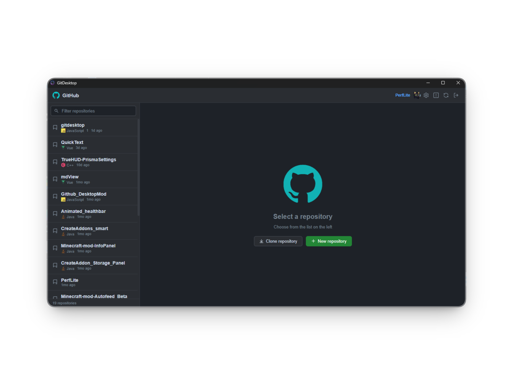
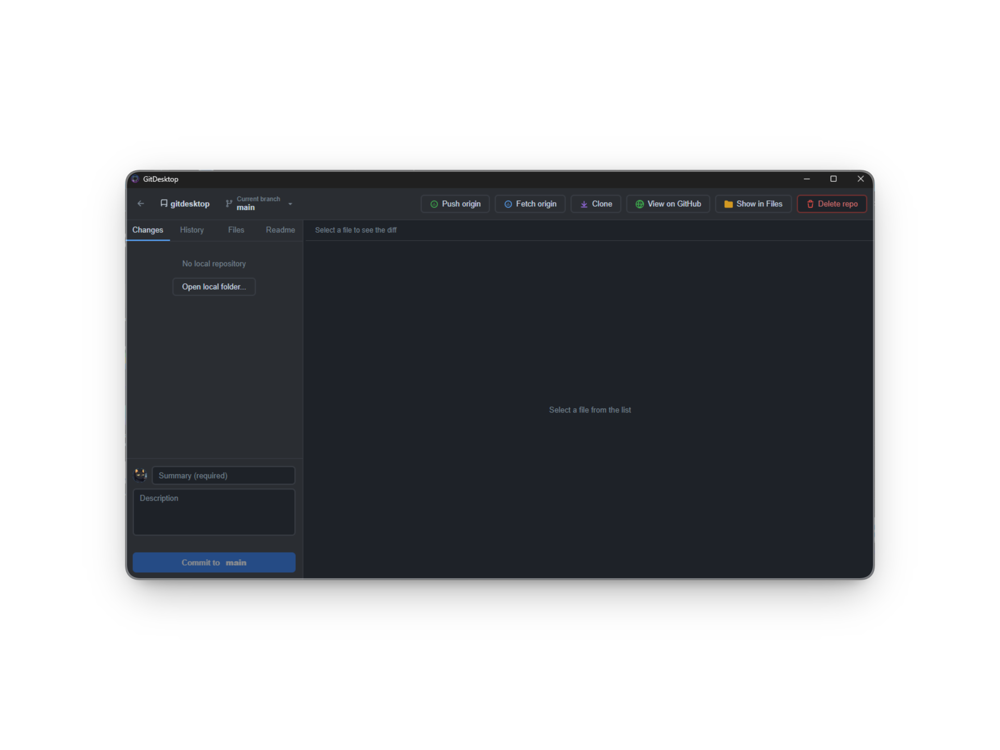
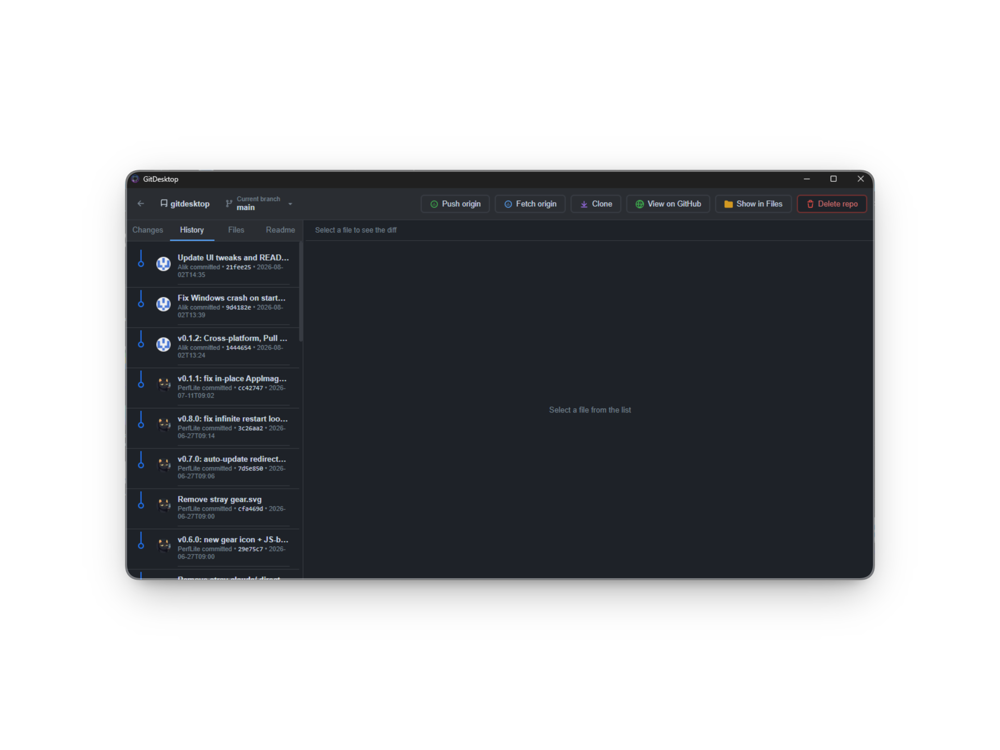
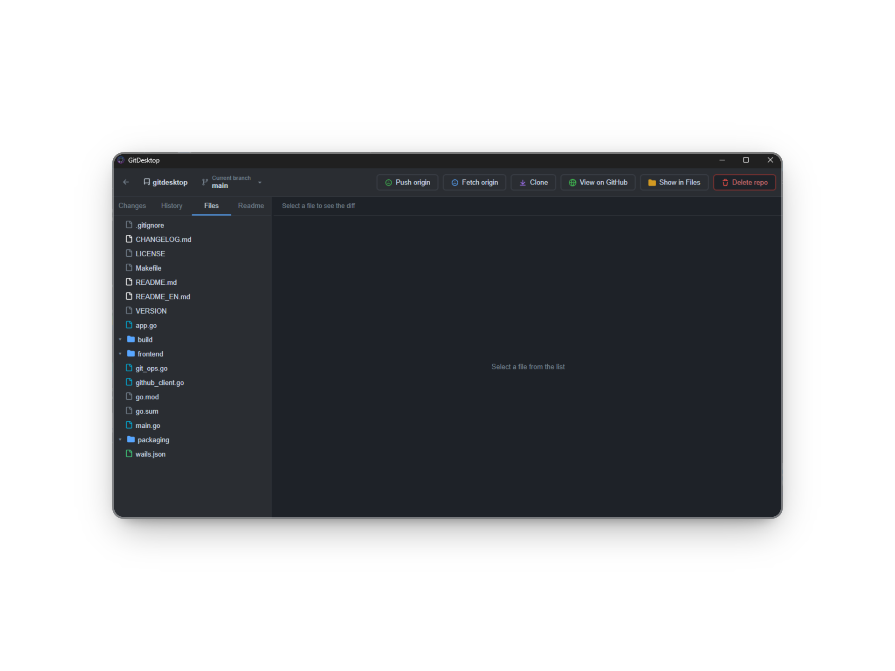
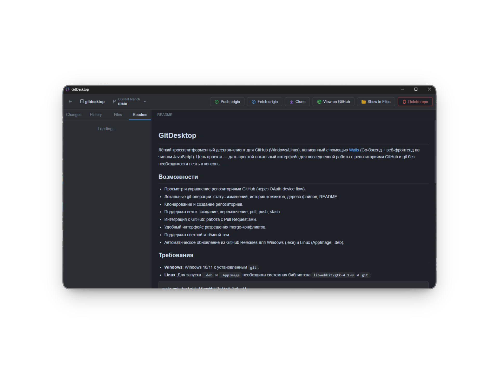

# GitDesktop

A lightweight cross-platform desktop client for GitHub (Windows/Linux), built with [Wails](https://wails.io/) (Go backend + a plain JavaScript web frontend). The goal is a simple local UI for everyday GitHub and git work without dropping to the terminal.

## Screenshots

<details>
<summary>View Application Screenshots</summary>







</details>

## Features

- Browse and manage your GitHub repositories (via OAuth device flow).
- Local git operations: change status, commit history, file tree, README.
- Clone and create repositories.
- Branch management: checkout, create, pull, push, stash.
- GitHub Integration: Pull Requests viewer.
- Intuitive merge conflict resolution.
- Light and dark themes support.
- Automatic updates from GitHub Releases (supports Windows .exe and Linux AppImage/.deb).

## Requirements

- **Windows**: Windows 10/11 with `git` installed.
- **Linux**: Both `.deb` and `.AppImage` require the system library `libwebkit2gtk-4.1-0` and `git`:

```bash
sudo apt install libwebkit2gtk-4.1-0 git
```

## Installation

### AppImage

Download `gitdesktop-<version>-x86_64.AppImage` from the Releases section, make it executable and run it:

```bash
chmod +x gitdesktop-*.AppImage
./gitdesktop-*.AppImage
```

### Debian / Ubuntu (.deb)

```bash
sudo apt install ./gitdesktop_<version>_amd64.deb
```

### From source

Requires Go 1.21+ and Wails installed:

```bash
go install github.com/wailsapp/wails/v2/cmd/wails@latest
wails build
```

## Building a release

```bash
make all       # build .deb and .AppImage (+ raw binary)
make release   # publish artifacts to GitHub Releases (requires `gh auth login`)
```

## Auto-update

On startup the app compares its version (from `VERSION`) with the latest GitHub release tag. If a newer version is available, it is downloaded and installed automatically, replacing the existing executable in-place seamlessly (including .exe on Windows).

## License

Distributed under the **GPL-3.0** license. See [LICENSE](LICENSE).
